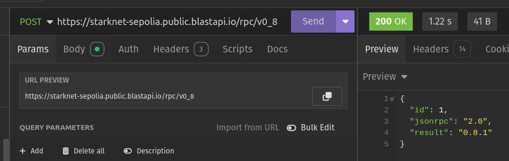

# 🏗 Friends - Group Savings on Starknet

<h4 align="center">
  <a href="https://docs.scaffoldstark.com/">Documentation</a> |
  <a href="https://scaffoldstark.com/">Website</a>
</h4>

🎯 A decentralized group savings platform built on Starknet blockchain. Friends makes it easy and fun to create shared savings goals, contribute together, and achieve your dreams as a group.

⚙️ Built using NextJS, Starknet.js, Scarb, Starknet-React, and Starknet Foundry.

## ✨ Features

- 🎯 **Create Savings Goals**: Set up shared targets for group activities, trips, or any collective dream.
- 👥 **Group Contributions**: Invite friends to contribute securely to your shared goals.
- 🔒 **Smart Contract Security**: Funds are safely locked until the target is reached.
- ⚡ **Instant Release**: Automatic fund release when the goal is achieved.
- 💫 **Beautiful UI/UX**: Modern, animated interface with real-time progress tracking.
- 🔐 **Wallet Integration**: Connect with various Starknet wallets.

## 🏦 Smart Contract Features

The `Pooler` smart contract provides the following functionality:

- Create savings pools with custom descriptions and target amounts
- Accept contributions in STRK tokens
- Track individual contributions and total pool progress
- Automatic completion when target is reached
- Secure withdrawal mechanism for pool recipients
- View pool details and contribution history

## 0. Requirements

Before you begin, you need to install the following tools:

- [Node (>= v18.17)](https://nodejs.org/en/download/)
- Yarn ([v1](https://classic.yarnpkg.com/en/docs/install/) or [v2+](https://yarnpkg.com/getting-started/install))
- [Git](https://git-scm.com/downloads)

## 1. Install developer tools

You can install the developer tools natively or use Dev Containers.

### Option 1: Natively install developer tools

#### 1.1 Starkup

Tool for installing all the Starknet essentials for development. [Starkup](https://github.com/software-mansion/starkup) will install the latest stable versions of:

- [Scarb](https://docs.swmansion.com/scarb/) - Cairo package manager and build toolchain
- [Starknet Foundry](https://foundry-rs.github.io/starknet-foundry/index.html) - Development toolchain for testing on Starknet
- [asdf](https://asdf-vm.com/guide/getting-started.html) - Version manager to easily switch between tool versions
- [Cairo 1.0 extension](https://marketplace.visualstudio.com/items?itemName=starkware.cairo1) for VSCode - Syntax highlighting and language support

>Currently, [starknet-devnet](https://0xspaceshard.github.io/starknet-devnet/) is not supported by `starkup` and needs to be installed separately (see instructions below).

To install `starkup`, run the following command:

```sh
curl --proto '=https' --tlsv1.2 -sSf https://sh.starkup.sh | sh
```

#### 1.2 Create your project

Open a terminal and run the following command:

```bash
npx create-stark@latest
cd my-dapp-example
yarn install
```

Now you have a new project with the basic structure.

#### 1.3 Install Starknet Devnet using ASDF Fast Install

- Install [asdf](https://asdf-vm.com/guide/getting-started.html) in case you don't have it installed yet. It allows you to manage the other dependencies with ease.

We are almost done, now we need to install `Starknet Devnet`. First let's register the Starknet Devnet plugin on `asdf`.

```bash
asdf plugin add starknet-devnet
```

Now open your new created project. Since we have the required dependencies listed on a `.tool-versions` file, simply running the below command on the root folder will install `starknet-devnet`(and other dependencies such as `scarb` and `starknet-foundry`) with the version SPECIFIED on the `.tool-versions` file (not necessarily the latest):

```bash
asdf install
```

Now you are ready!!!. You can jump to [Quickstart 1](#quickstart-1-deploying-a-smart-contract-to-starknet-devnet) to start developing your dapp.

#### 1.4 Troubleshooting

- If you run into version errors after using `starkup` or `asdf`, you can try to install the dependencies manually. Check the details below.

<details>

#### Scarb version

To ensure the proper functioning of scaffold-stark, your `Scarb` version must be `2.11.4`. To accomplish this, first check Scarb version:

```sh
scarb --version
```

If your `Scarb` version is not `2.11.4`, you need to install it. If you already have installed `Scarb` via `starkup`, you can setup this specific version with the following command:

```sh
asdf install scarb 2.11.4 && asdf set scarb 2.11.4
```

Otherwise, you can install Scarb `2.11.4` following the [instructions](https://docs.swmansion.com/scarb/download.html#install-via-asdf).

#### Starknet Foundry version

To ensure the proper functioning of the tests on scaffold-stark, your `Starknet Foundry` version must be `0.44.0`. To accomplish this, first check your `Starknet Foundry` version:

```sh
snforge --version
```

If your `Starknet Foundry` version is not `0.44.0`, you need to install it. If you already have installed `Starknet Foundry` via `starkup`, you can setup this specific version with the following command:

```sh
asdf install starknet-foundry 0.44.0 && asdf set starknet-foundry 0.44.0
```

Otherwise, you can install Starknet Foundry `0.44.0` following the [instructions](https://foundry-rs.github.io/starknet-foundry/getting-started/installation.html#installation-via-asdf).

#### Starknet-devnet version

To ensure the proper functioning of scaffold-stark, your `starknet-devnet` version must be `0.4.1`. To accomplish this, first check your `starknet-devnet` version:

```sh
starknet-devnet --version
```

If your `starknet-devnet` version is not `0.4.1`, you need to install it.

- Install starknet-devnet `0.4.1` via `asdf` ([instructions](https://github.com/gianalarcon/asdf-starknet-devnet/blob/main/README.md)).

</details>

### Option 2. Dev Containers

#### 2.1 Install Docker Desktop

As an alternative to installing the tools locally (Scarb, Starknet Foundry, Starknet Devnet), you can use Docker, this is the recommended option for `Windows` users. Here's what you need to do:

1. Install [Docker Desktop](https://www.docker.com/get-started/)
2. Install [Dev Containers](https://marketplace.visualstudio.com/items?itemName=ms-vscode-remote.remote-containers)
3. Create a new project folder.

- `npx create-stark@latest`
- `cd my-dapp-example`

4. Check your project folder contains a `devcontainer.json` file. This file is used to set up the environment:

- The configuration uses the `starknetfoundation/starknet-dev:2.11.4` image.
- This includes all required tools pre-installed, such as Scarb, Starknet Foundry, Starknet Devnet and other dependencies.

#### 2.2 Getting Started with Docker Setup

To start using the Docker-based setup:

1. Open the project in **Visual Studio Code**.
2. Select **"Reopen in Container"**.
3. If you need to rebuild the container, open the Command Palette (**View -> Command Palette**) and choose:
   - **Dev Containers: Rebuild and Reopen in Container**

> Once inside the container, you can start working with all the tools and dependencies pre-configured.

Now you are ready!!!

## Compatible versions

- Starknet-devnet - v0.4.1
- Scarb - v2.11.4
- Snforge - v0.44.0
- Cairo - v2.11.4
- Rpc - v0.8.0

## Quickstart 1: Running Friends Locally

To get started with Friends, follow these steps:

1. Clone the repository and install dependencies:

```bash
git clone <your-repo-url>
cd friends
yarn install
```

2. Run a local Starknet network in the first terminal:

```bash
yarn chain
```

This command starts a local Starknet network using Devnet. The network runs on your local machine and can be used for testing and development.

3. On a second terminal, deploy the Pooler contract:

```bash
yarn deploy
```

This deploys the Pooler smart contract that manages group savings pools. The contract is located in `packages/snfoundry/contracts/src/Pooler.cairo`.

4. On a third terminal, start your NextJS app:

```bash
yarn start
```

Visit your app on: `http://localhost:3000`. You can now:
- Create new savings goals
- Invite friends to contribute
- Track progress in real-time
- Test the full savings flow

5. Set up your environment variables:
   - Copy `.env.example` to `.env` in both `packages/nextjs` and `packages/snfoundry`
   - The `yarn postinstall` script will handle this automatically
   - Configure your RPC endpoints and other settings as needed

> ⚠️ **IMPORTANT**: Never commit private keys or sensitive environment variables to version control.

## Quickstart 2: Deploying to Sepolia Testnet

<details>

1. Prepare your environment variables:
   - In `packages/snfoundry/.env`: Add your wallet's account contract address and private key
   - In `packages/nextjs/.env`: Configure your Sepolia testnet RPC URL

2. Update your network configuration:
   - Find `packages/nextjs/scaffold.config.ts`
   - Set `targetNetworks` to `[chains.sepolia]`

3. Get test tokens:
   - You'll need STRK tokens on Sepolia to create and contribute to pools
   - Get tokens from:
     - [Starknet Faucet](https://starknet-faucet.vercel.app/)
     - [Blastapi Starknet Sepolia STRK](https://blastapi.io/faucets/starknet-sepolia-strk)

4. Deploy the Pooler contract:

```bash
yarn deploy --network sepolia
```

5. Start the frontend:

```bash
yarn start
```

Your dapp will now be connected to Sepolia testnet, ready for testing with real network conditions.

</details>

## Setup RPC specific version

<details>

To ensure the proper functioning of the scaffold-stark with Testnet or Mainnet, your RPC version must be `0.8.0`. This repository contains `.env.example` files, where we provided the default RPC URL for the Starknet Testnet: `RPC_URL_SEPOLIA=https://starknet-sepolia.public.blastapi.io/rpc/v0_8`. Let's verify this RPC version is `0.8.x` by calling a `POST` request in an API platform like `Postman` or `Insommia` . Your API endpoint should be `https://starknet-sepolia.public.blastapi.io/rpc/v0_8` and the body should be:

```json
{
  "jsonrpc": "2.0",
  "method": "starknet_specVersion",
  "id": 1
}
```

You have to paste the endpoint and body in the API platform and click on the `Send` button. If the response is `0.8.x`, then you are good to go. Otherwise, you have to get the correct RPC URL endpoint.



</details>

## Network Configuration Centralization

<details>

By default, Network settings are centralized in `scaffold.config.ts` with all RPC URLs defined in the `rpcProviderUrl` object. We strongly recommend to use environment variables to configure the networks, otherwise the framework will choose a random provider for you.

**How to Change Networks:**

- Update the `targetNetworks` array in `scaffold.config.ts` (first network is the primary target)
- Ensure each network has a corresponding RPC URL in the `rpcProviderUrl` object

### Required Environment Variables

Set these in your `.env` file:

- `NEXT_PUBLIC_DEVNET_PROVIDER_URL`
- `NEXT_PUBLIC_SEPOLIA_PROVIDER_URL`
- `NEXT_PUBLIC_MAINNET_PROVIDER_URL`

Configuration uses these variables with fallbacks:

```typescript
"devnet": process.env.NEXT_PUBLIC_DEVNET_PROVIDER_URL || process.env.NEXT_PUBLIC_PROVIDER_URL || "",
"sepolia": process.env.NEXT_PUBLIC_SEPOLIA_PROVIDER_URL || process.env.NEXT_PUBLIC_PROVIDER_URL || "",
"mainnet": process.env.NEXT_PUBLIC_MAINNET_PROVIDER_URL || process.env.NEXT_PUBLIC_PROVIDER_URL || ""
```

</details>

## CLI Usage

<details>
Depending on your package manager, substitute the word `COMMAND` with the appropiate one from the list.

```bash
yarn COMMAND
npm run COMMAND
```

This repo prefer yarn as package manager.

Commands:

| Command          | Description                                                                               |
| ---------------- | ----------------------------------------------------------------------------------------- |
| format:check     | (Read only) Batch checks for format inconsistencies for the nextjs and snfoundry codebase |
| next:check-types | Compile typscript project                                                                 |
| next:lint        | Runs next lint                                                                            |
| prepare          | Install husky's git hooks                                                                 |
| usage            | Show this text                                                                            |

### CLI Smart Contracts

| Command         | Description                                                                         |
| --------------- | ----------------------------------------------------------------------------------- |
| compile         | Compiles contracts.                                                                 |
| test            | Runs snfoundry tests                                                                |
| chain           | Starts the local blockchain network.                                                |
| deploy          | Deploys contract to the configured network discarding previous deployments.         |
| deploy:no-reset | Deploys contract to the configured network without discarding previous deployments. |
| verify          | Verify Smart Contracts with Walnut                                                  |

### CLI Frontend

| Command     | Description                                  |
| ----------- | -------------------------------------------- |
| start       | Starts the frontend server                   |
| test:nextjs | Runs the nextjs tests                        |
| vercel      | Deploys app to vercel                        |
| vercel:yolo | Force deploy app to vercel (ignoring errors) |

## **What's next**

- Edit your smart contract `YourContract.cairo` in `packages/snfoundry/contracts/src`
- Edit your frontend homepage at `packages/nextjs/app/page.tsx`. For guidance on [routing](https://nextjs.org/docs/app/building-your-application/routing/defining-routes) and configuring [pages/layouts](https://nextjs.org/docs/app/building-your-application/routing/pages-and-layouts) checkout the Next.js documentation.
- Edit your deployment scripts in `packages/snfoundry/script-ts/deploy.ts`
- Edit your smart contract tests in `packages/snfoundry/contracts/src/test`. To run tests use `yarn test`
- You can write unit tests for your Next.js app! Run them with one the following scripts below.
  - `yarn test:nextjs` to run regular tests with watch mode
  - `yarn test:nextjs run` to run regular tests without watch mode
  - `yarn test:nextjs run --coverage` to run regular tests without watch mode with coverage

## Development Workflow

### Smart Contract Development

The Pooler contract is located in `packages/snfoundry/contracts/src/Pooler.cairo`. Key features:

- Pool creation and management
- Contribution handling
- Progress tracking
- Secure fund release
- Event emission for frontend updates

To modify the contract:
1. Edit `Pooler.cairo`
2. Run tests: `yarn test`
3. Deploy changes: `yarn deploy`

### Frontend Development

The frontend is a Next.js application in `packages/nextjs`. Key components:

- `app/page.tsx`: Main landing and pool creation interface
- `app/debug/`: Contract debugging interface
- `components/scaffold-stark/`: Reusable web3 components
- `hooks/scaffold-stark/`: Contract interaction hooks

To work on the frontend:
1. Start the development server: `yarn start`
2. Make changes to components/pages
3. Test interactions with the contract

### Available Commands

| Command          | Description                                                                               |
| ---------------- | ----------------------------------------------------------------------------------------- |
| `yarn chain`     | Start local Starknet network                                                              |
| `yarn deploy`    | Deploy Pooler contract                                                                    |
| `yarn start`     | Start Next.js development server                                                          |
| `yarn test`      | Run contract tests                                                                        |
| `yarn test:nextjs`| Run frontend tests                                                                       |

## Contributing

We welcome contributions to Friends! Here's how you can help:

1. Fork the repository
2. Create a feature branch
3. Make your changes
4. Write/update tests
5. Submit a pull request

Please ensure your PR:
- Includes tests for new functionality
- Updates documentation as needed
- Follows the existing code style
- Includes a clear description of changes

## License

MIT License. See [LICENSE](LICENSE) for details.

## Support

Need help? Join our community:
- [GitHub Issues](https://github.com/your-repo/friends/issues)
- [Documentation](https://docs.scaffoldstark.com/)
